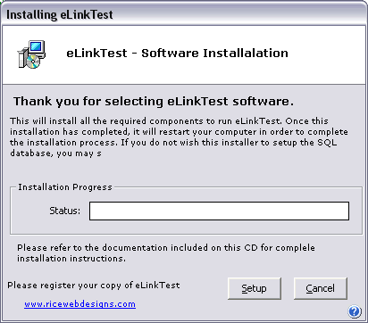

<div align="center">

## App Installer v1\.1


</div>

### Description

VB based Installer that Installs a new app, Unzips files, Creates directories, copies files, registers DLL's, Creates Program Shortcuts, runs external programs required for installation, removes and/or writes registry keys. Thanks to all who contributed to this submission. I used a lot of code from here and other VB sites to create this little app.
 
### More Info
 
You will need to get UnZip.DLL from www.info-zip.org in order to run this or you can simply replace it. I wish I could take all the credit for this code but I got a great deal of it from Planet Source Code and others. I simply put it together with some of my own code to create this installer. It does quite a bit but this is only the initial version so let me know what you think so I can improve this thing. The setup.ini file is similar to the Seupt.LST generated by the Vb Package and deployment wizard with some additions. Thanks to everyone who contributed to this so far and I hope I can complete the release(free) version by January 2004.


<span>             |<span>
---                |---
**Submitted On**   |2003-11-30 09:45:28
**By**             |[Thomas Rice Jr](https://github.com/Planet-Source-Code/PSCIndex/blob/master/ByAuthor/thomas-rice-jr.md)
**Level**          |Intermediate
**User Rating**    |4.8 (24 globes from 5 users)
**Compatibility**  |VB 6\.0
**Category**       |[Miscellaneous](https://github.com/Planet-Source-Code/PSCIndex/blob/master/ByCategory/miscellaneous__1-1.md)
**World**          |[Visual Basic](https://github.com/Planet-Source-Code/PSCIndex/blob/master/ByWorld/visual-basic.md)
**Archive File**   |[App\_Instal16780811302003\.zip](https://github.com/Planet-Source-Code/thomas-rice-jr-app-installer-v1-1__1-50198/archive/master.zip)

### API Declarations

```
CreateDirectoryEx
SHBrowseForFolder
SHGetPathFromIDListA
SHGetSpecialFolderLocation
SHGetPathFromIDList
lstrcat
UnhookWindowsHookEx
GetWindowLong
GetCurrentThreadId
SetWindowsHookEx
SetWindowPos
GetWindowRect
GetOpenFileName
GetSaveFileName
ChooseColor
CommDlgExtendedError
GetShortPathName
ChooseFont
PrintDlg
ReleaseDC
GetClientRect
GetParent
SetActiveWindow
SetForegroundWindow
GetVersionEx
GetTickCount
IsWindowVisible
SetWindowText
GetWindowsDirectory
GetSystemDirectory
OpenIcon
FindWindow
GetWindow
GetPrivateProfileString
RegOpenKeyEx
RegQueryValueEx
RegCreateKey
RegSetValueExString
RegCloseKey
RegSetValueExLong
CreateProcessBynum
OpenProcess
CloseHandle
WaitForSingleObject
WaitForInputIdle
MoveFile
CreateDirectory
SetCurrentDirectory
GetCurrentDirectory
CopyFile
ExitWindowsEx
GetCurrentProcess
OpenProcessToken
LookupPrivilegeValue
AdjustTokenPrivileges
GetOSVersion
GetOSVersionEx
VerifyVersionInfo
VerSetConditionMask
ZeroMemory
GetDiskFreeSpace
GetVolumeInformation
GetComputerName
GetUserName
GlobalMemoryStatus
GetShortPathName
GetDeviceCaps
GetDriveType
waveOutGetNumDevs
LoadLibraryRegister
FreeLibraryRegister
CreateThreadForRegister
CloseHandle
GetProcAddressRegister
WaitForSingleObject
GetExitCodeThread
ExitThread
RegOpenKeyEx
RegCloseKey
RegQueryValueEx
RegSetValueEx
RegCreateKeyEx
RegDeleteKey
RegDeleteValue
RegEnumKeyEx
RegEnumValue
RegConnectRegistry
ExpandEnvironmentStrings
CopyMemory
```


